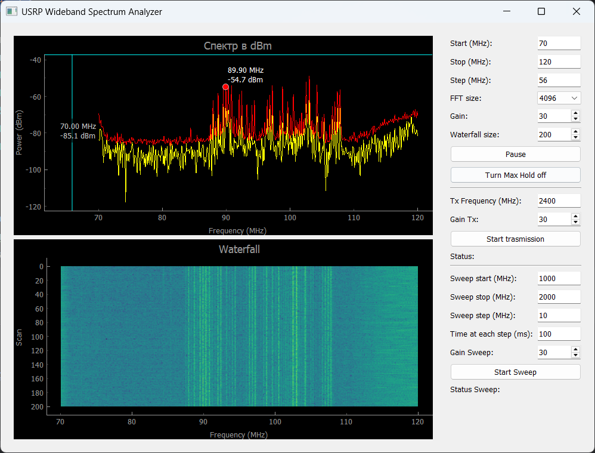
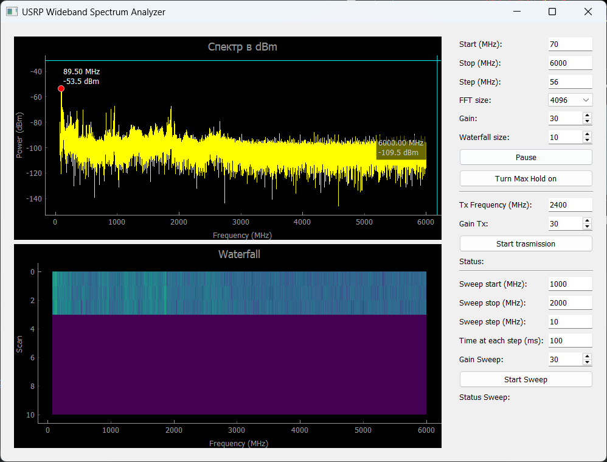
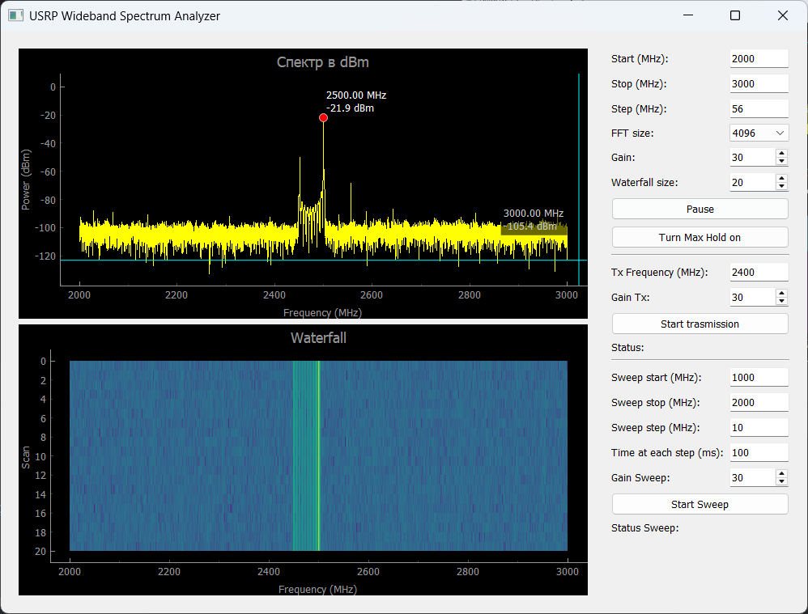
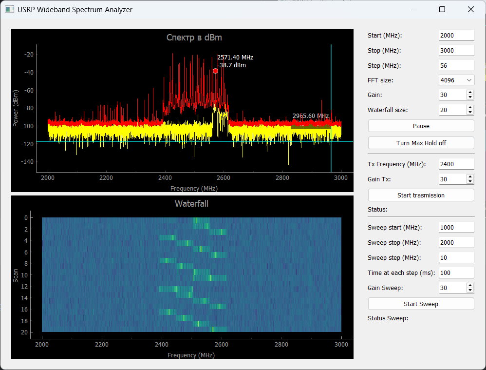

# USRP Spectrum Analyzer & Signal Generator

This project turns your USRP SDR (Software Defined Radio) into a **wideband spectrum analyzer and signal generator** with a modern, user-friendly GUI.

While most SDR devices are limited to an instantaneous bandwidth of around **60 MHz**, this software allows you to **view the entire frequency range** by sweeping, **without the need for additional RF front-end modules**.

## 🔧 Features

- 📡 **Wideband Spectrum Analyzer**  
  View the full frequency range of your USRP using sweep scanning techniques.

- 🌈 **Waterfall Display**  
  Real-time waterfall for time-frequency analysis.

- 📊 **Max Hold Mode**  
  Easily observe peak signals over time.

- ⚙️ **Fully Configurable**  
  - Start and stop frequencies  
  - Adjustable FFT size  
  - Receiver gain control  
  - Step size and scan delay

- 🚀 **Signal Generator (TX)**  
  Supports both:
  - Continuous Wave (CW) mode  
  - Frequency Sweep Mode

- 🔁 **Full-Duplex Operation**  
  Transmit and receive simultaneously using separate USRP channels.

- 🖥️ **Intuitive GUI**  
  Built with PyQt and PyQtGraph for fast and interactive visualization.

## ✅ Requirements

Before running the application, make sure the following are installed on your system:

- [UHD Drivers & Libraries](https://files.ettus.com/manual/page_install.html) (latest version recommended)
- Python 3.9+ (if running from source)
- The following Python packages:
  - `pyqtgraph`
  - `PyQt5`
  - `numpy`
  - `uhd` (Python bindings for UHD)

## 📦 Tested Hardware

- ✔️ **USRP B205mini**  
  Successfully tested and verified in both RX and TX modes.

